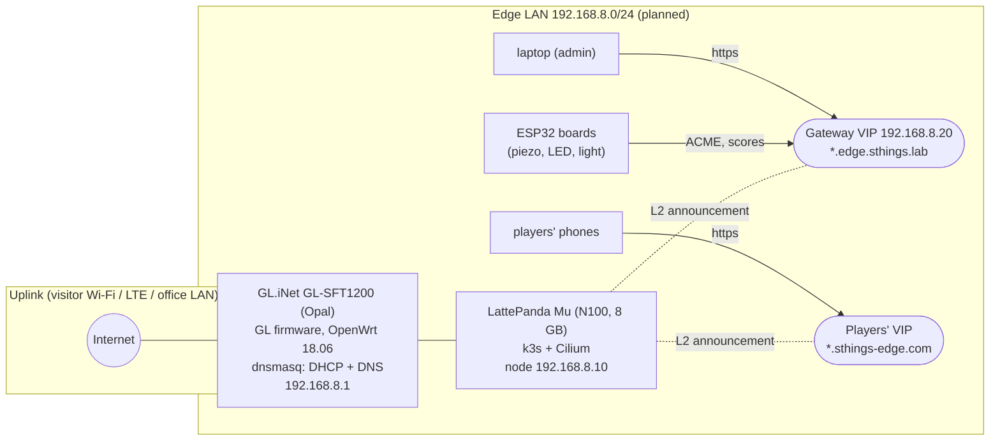
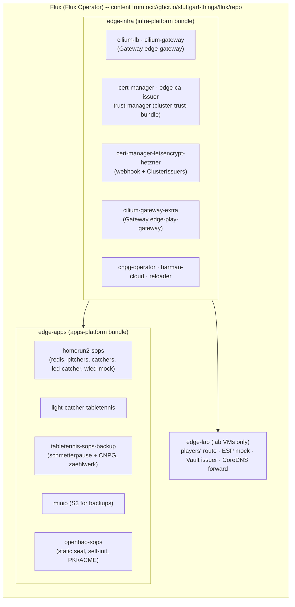
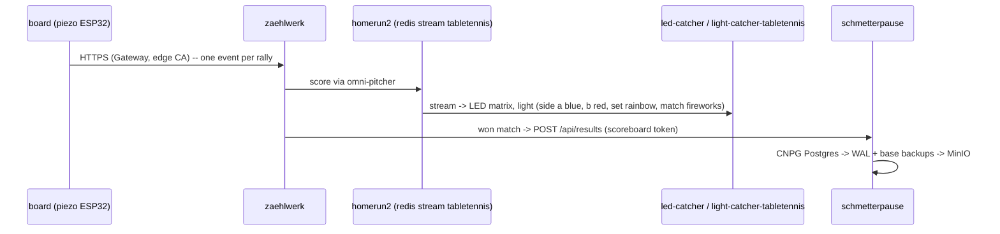
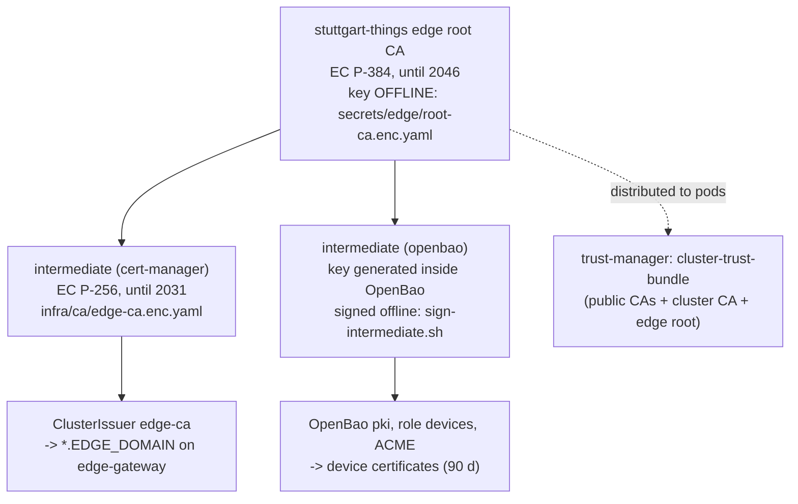
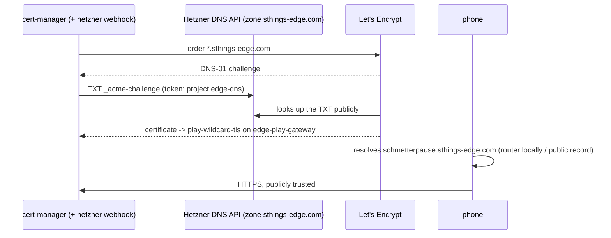

# Edge cluster -- architecture

How the single-node edge cluster fits together: the box, the router, k3s and
Cilium, the services on the cluster, and the **two name worlds** -- the
internal one with the edge's own CA (and OpenBao for the devices), and the
public one at Hetzner DNS with Let's Encrypt. The how-to is in
[README.md](./README.md) (layout, *Recreate from scratch*); history in
[NOTES.md](./NOTES.md); tracking issue harvester#364.

## The site



- **One node does everything** (README: no central OpenBao/ESO, NFS, lab DNS,
  S3 or Rancher). It runs only occasionally.
- **The router** is the network: the uplink on WAN (repeater or cable), the
  edge LAN behind it stays the same wherever the box is. dnsmasq hands out
  addresses and **is the DNS of the edge**: the domain `edge.sthings.lab`,
  static leases for the node and the boards, the service names, and -- locally
  -- the public players' name. Keep the GL firmware: vanilla OpenWrt lacks the
  switch driver for this board.
- **Cilium** replaces kube-proxy and announces the **VIPs** on the LAN (L2
  announcements, `CiliumLoadBalancerIPPool`); its Gateway API implementation
  terminates TLS. One VIP per Gateway.
- Addresses on the **lab VMs** instead: `edge-tt-test1` (LabDA,
  `10.100.136.89`, VIPs `.223` / `.226`), `edge-tt-test2` (labul,
  `10.31.102.144`, VIPs `.7` / `.8`) -- names and VIPs from Clusterbook there,
  no router.

## The cluster



Everything Flux applies is **generated** from
[`cluster-apps.yaml`](./cluster-apps.yaml) (README, *Layout: who creates
what*); secrets are SOPS, their values in `secrets/edge/`.

**The game, end to end:**



The zaehlwerk page offers schmetterpause's players and scorers
(`/api/players`, `/api/operators`; observers such as the admin `timoboll`
count but never play).

## Two name worlds

| | **Internal** | **Public (players)** |
|---|---|---|
| Names | `*.edge.sthings.lab` (box) -- lab: `*.edge-tt-test1.4sthings.tiab.ssc.sva.de`, `*.edge-tt-test2.sthings-vsphere.labul.sva.de` | `*.sthings-edge.com` -- `edge-tt-test2`: `*.test2.sthings-edge.com` |
| Who resolves them | the router's dnsmasq (box), Clusterbook / lab DNS (lab) | **Hetzner DNS** (zone `sthings-edge.com`, project `edge-dns`); on the box the router answers the same names **locally** with the players' VIP |
| Gateway | `edge-gateway` on the Gateway VIP | `edge-play-gateway` on the players' VIP |
| Certificates | the **edge CA** (own, persistent) | **Let's Encrypt** (DNS-01 at Hetzner) |
| Trusted by | clients that installed `edge-root-ca.crt`; devices; pods via trust-manager | every browser and phone |
| Used for | admin UIs, zaehlwerk, homerun2, OpenBao, MinIO, device traffic | schmetterpause for the players |

### Internal: the edge CA and OpenBao



- **One root for everything internal**, generated once and kept: a reinstall
  or the move to the box changes nothing a client or device trusts.
- **Devices enrol themselves** at OpenBao via ACME (HTTP-01 today,
  `eab_policy not-required`; EAB per device + static leases are the stricter
  option). OpenBao validates the device's name through
  `acme_dns_resolver` -- **the router** on the box
  (`terraform/openbao/env/box.auto.tfvars.json`, `192.168.8.1:53` once it is
  set up), the cluster DNS on the lab.
- **OpenBao** unseals itself (static seal, key from SOPS) and initialises
  itself on empty storage (self-init: users `terraform` for the PKI,
  `admin` break-glass); Terraform (`terraform/openbao`) configures the PKI.
- **Pods** trust the edge root through `cluster-trust-bundle` -- that is how
  zaehlwerk calls schmetterpause over HTTPS through the Gateway.

### Public: Hetzner DNS and Let's Encrypt



- **DNS-01 needs no inbound access**: it works behind visitor Wi-Fi or LTE.
  The box only needs outbound HTTPS to the Hetzner API and Let's Encrypt.
- The **public A record** (`*` → the players' VIP) is a private address. That
  is enough in the lab; on the box the router answers the name locally anyway,
  so phones on the edge Wi-Fi never depend on it.
- The Hetzner token is **project-wide** (Read & Write): the zone lives alone
  in project `edge-dns`. Value: `HETZNER_DNS_TOKEN` in
  `secrets/edge/app-values.enc.yaml`.

## DNS commands

### Lab: Clusterbook

Names and VIPs of the lab VMs. Details and the Dagger variant:
[`../edge-test2/README.md`](../edge-test2/README.md) (step 1).

```bash
C=http://clusterbook.infra.sthings-vsphere.labul.sva.de      # labul (LabDA: clusterbook.sthings-infra.4sthings.tiab.ssc.sva.de)
curl -s $C/api/v1/networks/10.31.102/ips | jq -r '.[] | [.ip, (if .status=="" then "free" else .status end), .cluster] | @tsv'
# reserve (never overwrites; 409 if taken) -- with wildcard DNS *.<cluster>.<zone>
curl -s -X POST $C/api/v1/networks/10.31.102/reserve -H 'Content-Type: application/json' \
  -d '{"cluster":"edge-tt-test2","status":"ASSIGNED","create_dns":true,"ip":"10.31.102.7"}'
```

### Public: Hetzner DNS (zone `sthings-edge.com`)

Hetzner Cloud API, `zones/{zone}/rrsets`. The token comes from SOPS into a
header file, never onto a command line:

```bash
umask 077; H=$(mktemp)
sops -d --extract '["stringData"]["HETZNER_DNS_TOKEN"]' secrets/edge/app-values.enc.yaml \
  | sed 's/^/Authorization: Bearer /' > $H
API=https://api.hetzner.cloud/v1/zones/sthings-edge.com

# list
curl -s -H @$H $API/rrsets | jq -r '.rrsets[] | [.name, .type, ([.records[].value]|join(" "))] | @tsv'
# create: *.sthings-edge.com -> players' VIP of edge-tt-test1 (done 2026-10-05)
curl -s -H @$H -H 'Content-Type: application/json' -X POST $API/rrsets \
  -d '{"name":"*","type":"A","ttl":300,"records":[{"value":"10.100.136.226"}]}'
# create: *.test2.sthings-edge.com -> players' VIP of edge-tt-test2
curl -s -H @$H -H 'Content-Type: application/json' -X POST $API/rrsets \
  -d '{"name":"*.test2","type":"A","ttl":300,"records":[{"value":"10.31.102.8"}]}'
# change the address of an existing record set (e.g. for the box)
curl -s -H @$H -H 'Content-Type: application/json' -X POST "$API/rrsets/*/A/actions/set_records" \
  -d '{"records":[{"value":"192.168.8.21"}]}'
# delete
curl -s -H @$H -X DELETE "$API/rrsets/*.test2/A"

shred -u $H
```

Check -- publicly (DNS-over-HTTPS, independent of the local resolvers) and in
the cluster:

```bash
curl -s -H 'accept: application/dns-json' 'https://cloudflare-dns.com/dns-query?name=schmetterpause.sthings-edge.com&type=A' | jq -c '[.Answer[]?.data]'
dig +short NS sthings-edge.com @a.gtld-servers.net +norec      # delegation: hydrogen/oxygen/helium
kubectl run dnstest --rm -i --restart=Never --image=curlimages/curl -- nslookup schmetterpause.sthings-edge.com
```

### Box: the router (dnsmasq) -- planned

Not applied yet (the router is new). On the GL firmware via SSH (`uci`),
addresses as planned in harvester#364:

```bash
# the edge domain, never forwarded upstream
uci set dhcp.@dnsmasq[0].domain='edge.sthings.lab'
uci set dhcp.@dnsmasq[0].local='/edge.sthings.lab/'
# answers with private addresses are fine for these names (rebind protection)
uci add_list dhcp.@dnsmasq[0].rebind_domain='edge.sthings.lab'
uci add_list dhcp.@dnsmasq[0].rebind_domain='sthings-edge.com'
# internal services -> the Gateway VIP (concrete names or a sub-zone, NOT
# address=/edge.sthings.lab/ -- that would also catch the devices' names)
for n in zaehlwerk openbao minio minio-console led-catcher light-catcher wled-mock config-viewer; do
  uci add_list dhcp.@dnsmasq[0].address="/$n.edge.sthings.lab/192.168.8.20"
done
# the public players' names, answered locally with the players' VIP
uci add_list dhcp.@dnsmasq[0].address='/sthings-edge.com/192.168.8.21'
# static leases: the node and each board (MAC -> name -> address)
uci add dhcp host; uci set dhcp.@host[-1].name='edge'; uci set dhcp.@host[-1].mac='<node MAC>'; uci set dhcp.@host[-1].ip='192.168.8.10'
uci add dhcp host; uci set dhcp.@host[-1].name='piezo-a'; uci set dhcp.@host[-1].mac='<board MAC>'; uci set dhcp.@host[-1].ip='192.168.8.50'
uci commit dhcp && /etc/init.d/dnsmasq restart
```

Check from a client on the edge Wi-Fi: `dig +short zaehlwerk.edge.sthings.lab`
→ `192.168.8.20`, `dig +short schmetterpause.sthings-edge.com` →
`192.168.8.21`, `dig +short piezo-a.edge.sthings.lab` → the board. In the GL
UI, "Override DNS Settings for All Clients" must not bypass dnsmasq.
