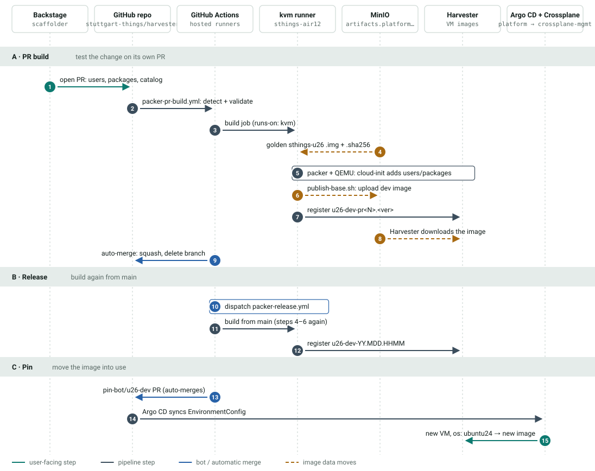

# Dev Image Chain

How a self-service dev image such as `u26-dev` gets from a click in Backstage to
a VM running on it. The chain involves GitHub, the kvm runner, MinIO, Harvester,
Argo CD and Crossplane. Numbers follow the order of events.

*Click the diagram to open it at full size.*

## A · PR build

Tests the change on its own PR before anything reaches `main`.

| # | Step | Where |
|---|------|-------|
| 1 | *Create Harvester VM-Template* opens a PR on `backstage/dev-<name>-<user>-config`. It changes `packages.yaml`, `users.yaml` and `catalog-info.yaml` under `packer/dev/<name>/`. | Backstage |
| 2 | `packer-pr-build.yml` detects the changed image dirs and validates every var-file. | GitHub-hosted |
| 3 | The build job runs on the single self-hosted runner (`runs-on: kvm`). | `sthings-air12` |
| 4 | Packer fetches the golden base (`source_url`) and checks it against its `.sha256` (`source_checksum`). | MinIO |
| 5 | QEMU boots the golden image, and cloud-init adds the users and packages. Packer waits for `boot-finished`. | kvm runner |
| 6 | `publish-base.sh` uploads the image to `packer/dev/<name>/`. | MinIO |
| 7 | `register-image.sh` creates the image `<name>-pr<N>.<YY.MDD.HHMM>`. | Harvester |
| 8 | Harvester downloads the image from the MinIO URL itself (`sourceType: download`). | Harvester |
| 9 | Auto-merge (squash, delete branch), but only if every dev build is green and the PR touches nothing outside `packer/dev/`. | GitHub-hosted |

!!! note "Why Backstage must not open PRs with `GITHUB_TOKEN`"
    GitHub starts no workflow for events caused by `GITHUB_TOKEN`. Backstage
    opens the PR under a real account, so step 2 starts.

## B · Release

Builds the image again from `main`.

| # | Step | Where |
|---|------|-------|
| 10 | The auto-merge job **dispatches** `packer-release.yml` for each dev image. | GitHub-hosted |
| 11 | Same packer build as steps 4–6, from `main`. | kvm runner |
| 12 | Registers the image under its release name `<name>-<YY.MDD.HHMM>`. | Harvester |

The auto-merge job merges with `GITHUB_TOKEN`, so the push to `main` starts no
workflow (harvester#270). `workflow_dispatch` is the one event that token may
start, which is why the release is dispatched explicitly. `gh workflow run
packer-release.yml --ref main -f tier=dev -f name=<name>` is also the manual way
to release an image again.

## C · Pin

Moves the new image into use.

| # | Step | Where |
|---|------|-------|
| 13 | The `pin-bot/<name>` PR moves the pin in `clusters/crossplane-mgmt/platform/virtual-machine/env-config-virtualmachine.yaml`. Aliases move with their image (`ubuntu24` → `u26-dev`). | GitHub |
| 14 | Argo CD `showcase-crossplane-platform` syncs the EnvironmentConfig to crossplane-mgmt. | platform |
| 15 | The next VM ordered with `os: ubuntu24` boots from the new image. | Crossplane → Harvester |

Images are never replaced in place. A newly registered image changes nothing
until its pin moves. Dev pins auto-merge. Golden pins wait for review, because
moving a golden pin affects every VM built from it.

## Where it breaks

- **kvm runner offline.** Steps 3 and 11 queue forever. There is only one
  runner, and it is registered on the repo, not the org:
  `gh api repos/stuttgart-things/harvester/actions/runners`.
- **MinIO down.** Step 4 cannot fetch the golden base, and the PR build hangs
  for 80–100 minutes before it fails.
- **Unknown package.** cloud-init drops the whole package list, but the build
  still goes green (harvester#314).
- **Leftover Backstage branch.** A second run with `update: true` pushes onto
  the old `backstage/dev-<name>-*` branch. Delete the branch first.

Sources: `.github/workflows/packer-pr-build.yml`,
`.github/workflows/packer-release.yml`, `packer/_build/`.
