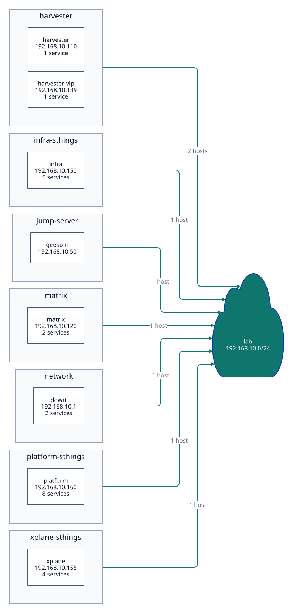

# System inventory

Topology diagram, service catalogue and interactive address book for the
stuttgart-things lab, generated from **`inventory.yaml`**.

`inventory.yaml` is the only file maintained by hand. `gen.py` turns it into
`topology.d2`, `d2` renders `topology.svg`. Both artifacts are committed so the
diagram shows up directly in GitHub.



There is also an **interactive version on GitHub Pages**, split into three
tabs — Topology, Addresses, Services — so nothing has to be scrolled past.
Each tab is deep-linkable (`#services`) and the last one used is remembered
per browser. Nodes can be dragged
and stay where you drop them, clicking one shows its description and the
services it runs, an address matrix lays out all 256 addresses of the `/24`
(statically assigned, DHCP pool, free), and a service index lists everything
running in the lab — grouped by cluster, sortable by any column, filterable by
free text. Diagram and matrix are linked: selecting in one
highlights in the other.

## Adding or changing a host

```bash
cd system-inventory
make d2-install          # once, fetches the d2 binary into ~/.local/bin
make d3-install          # once, fetches vendor/d3.min.js from the npm registry
$EDITOR inventory.yaml
make diagram             # writes topology.d2 + topology.svg
make serve               # builds the D3 page and serves it on :8000
```

Commit `topology.d2` and `topology.svg` along with your change — CI verifies
they match `inventory.yaml`. The HTML page is **not** committed; CI builds it.
It is 95 % embedded d3 bundle, so every inventory change would otherwise be a
300 KB diff.

## Schema

A host entry is `system`, `hostname`, `ip`, `description`, plus two optional
fields:

```yaml
hosts:
  - system: infra-sthings
    hostname: infra
    ip: 192.168.10.150
    kind: k3s-cluster              # host | k3s-cluster | hypervisor | router
    cluster: infra                 # matches the directory under clusters/
    description: >-
      Single-node k3s cluster `infra.sthings.lab` (Cilium LB VIP).
    services:
      - name: Vault
        fqdn: vault.infra.sthings.lab
        description: PKI for sthings-lab.
      - name: NFS
        port: 2049
        description: Shared storage behind the NFS CSI driver.
```

`cluster` names the Kubernetes cluster a host and its services belong to.
Values match the directories under `clusters/`, so the service index can be
read against the GitOps tree. Hosts outside any cluster (router, jump server)
leave it out, and their services sort to the bottom of the index. The service
index is keyed on the cluster rather than the host: for the single-node
clusters the two are the same, so a Host column would only restate the cluster.
The host is named on a row only where it adds something — a cluster served by
more than one host, or a service outside any cluster. Setting
`kind: k3s-cluster` without a `cluster` name is a validation error.

**Services nest under the host that serves them and inherit its IP.** That is
the point of the nesting: Vault and Clusterbook are both published on the same
Cilium LB VIP and told apart by FQDN, not by address — as separate `hosts`
rows they would trip the duplicate-IP check.

Per service, `name` and `description` are required; `fqdn`, `port`, `ip` and
`url` are optional. A service with an `fqdn` is rendered as a link to
`https://<fqdn>`; set `url` when the real entry point differs — a path, a port,
plain http. A service only needs its own `ip` when it gets a separate
load-balancer address — it then joins the duplicate-IP check like a host. A
service with no endpoint at all is fine and lists without a link: Crossplane
and the Clusterbook operator are reached through the Kubernetes API, not over
an ingress.

Chart and app versions are deliberately **not** tracked here. They live in
`clusters/**/*.yaml` and would go stale the moment they were copied.

## Validation

`make gen` (and therefore `make diagram`) exits 1 on:

- duplicate IPs, including a service IP colliding with a host
- duplicate hostnames
- duplicate service FQDNs
- invalid IPs and out-of-range ports
- IPs outside every network defined under `networks`
- a missing description or hostname, or a service without a description
- `kind: k3s-cluster` without a `cluster` name

`make check` additionally does what CI does: render, then diff against the
committed artifacts. That way `topology.svg` cannot silently fall behind
`inventory.yaml`.

## Diagram

Two things are deliberate in the generated D2 and worth keeping:

**No `|md|` labels.** D2 renders markdown labels as `<foreignObject>`, which
drops the shape and leaves many PDF/SVG pipelines showing nothing at all.
Labels are plain strings broken with `\n` instead, which yields native
`<text>`/`<tspan>`. `make diagram` aborts if a `<foreignObject>` ends up in the
SVG; the workflow checks the same thing.

**Layout engine ELK**, set through `vars.d2-config.layout-engine` in the
generated D2 file. The default `dagre` produces crossing edges on this star
topology.

Edges run **per system → network** with the host count as the label, not one
edge per host — otherwise the picture becomes unreadable at 20 hosts.

For the same reason a host node shows only its **service count**, never the
services themselves. The topology diagram answers *what is on the network*;
*what runs where* is a different question, and the service index on the HTML
page is where it gets answered.

## Interactive page

`build_html.py` combines `inventory.yaml`, `template.html` and
`vendor/d3.min.js` into a single self-contained HTML file. The d3 bundle is
**inlined** — no CDN, no network at runtime, no build step on open. The file
runs over `file://` exactly as it does behind a web server.

Two things only surface when the page is served over HTTP, so they are built in:

- **`<meta charset="utf-8">`.** `template.html` is a fragment; `build_html.py`
  is what turns it into a complete document. Without the declaration the
  browser guesses whenever a server sends no `charset`, and every non-ASCII
  character breaks.
- **No CDN.** `cdn.jsdelivr.net` is blocked on plenty of locked-down networks.
  The bundle is fetched with `npm pack d3@$(D3_VERSION)` into `vendor/`
  (gitignored) and inlined into the page.

Fonts come from Google Fonts; without network the fallback stack takes over.

## Deployment

`.github/workflows/system-inventory.yml` validates the inventory, checks the
committed SVG is current, builds the D3 page and deploys it to GitHub Pages
(from `main` only). This requires **Settings → Pages → Source: GitHub Actions**
to be set once in the repo.

## Optional fields

The network entry understands two optional fields that only the address matrix
reads — `gen.py` ignores them:

```yaml
networks:
  - cidr: 192.168.10.0/24
    gateway: 192.168.10.1
    dhcp_pool: 192.168.10.100-192.168.10.149
```

Without them the matrix only distinguishes assigned from free.

## Generated files

`vendor/` and `site/` are gitignored and rebuilt on every build — do not edit
them by hand. `topology.d2` and `topology.svg` are generated too, but committed
so GitHub can render the diagram.
